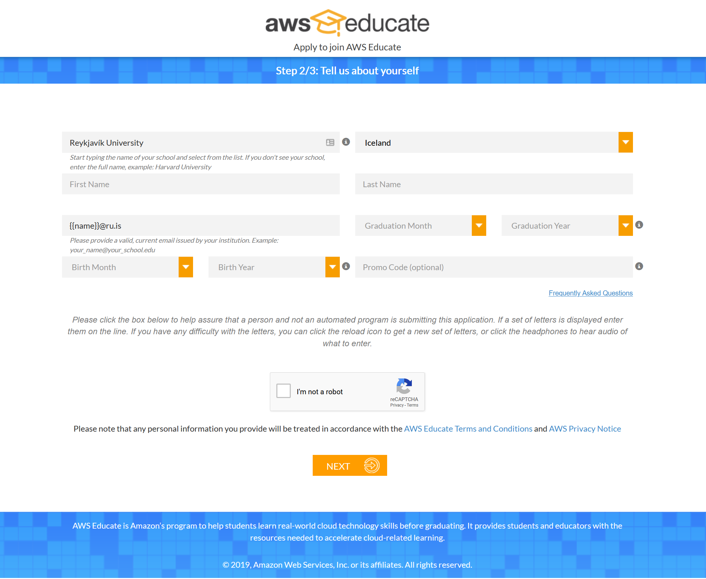
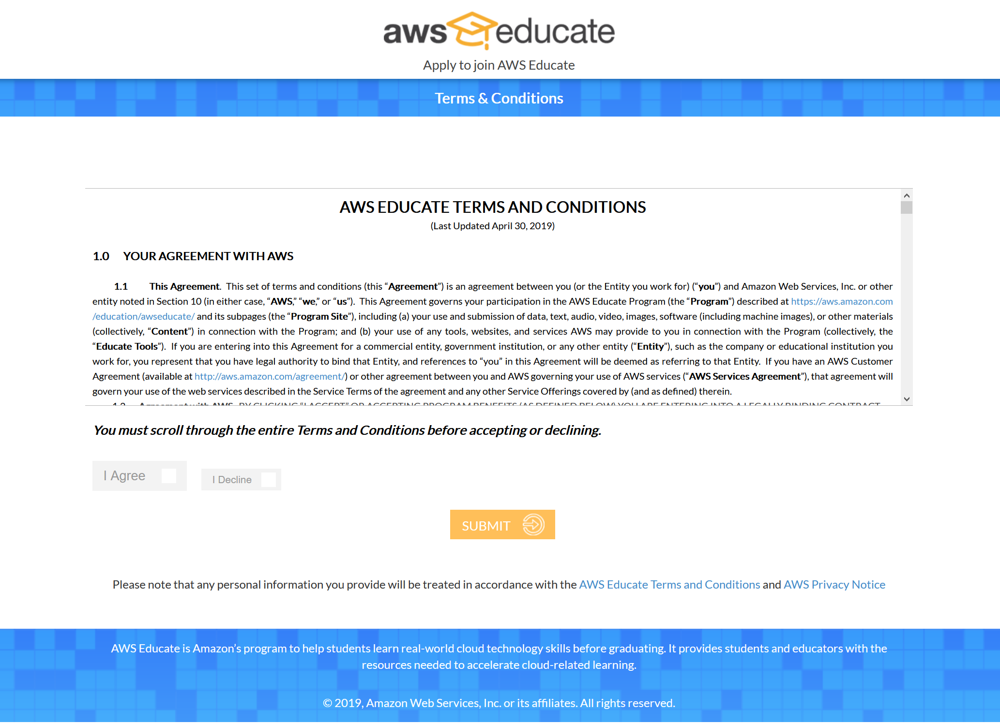
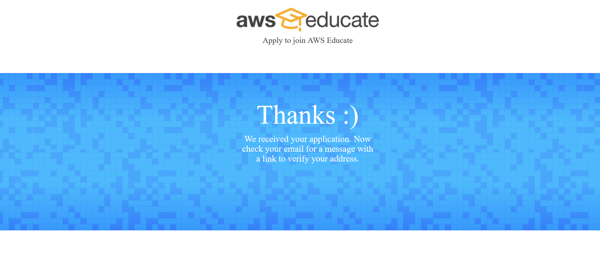
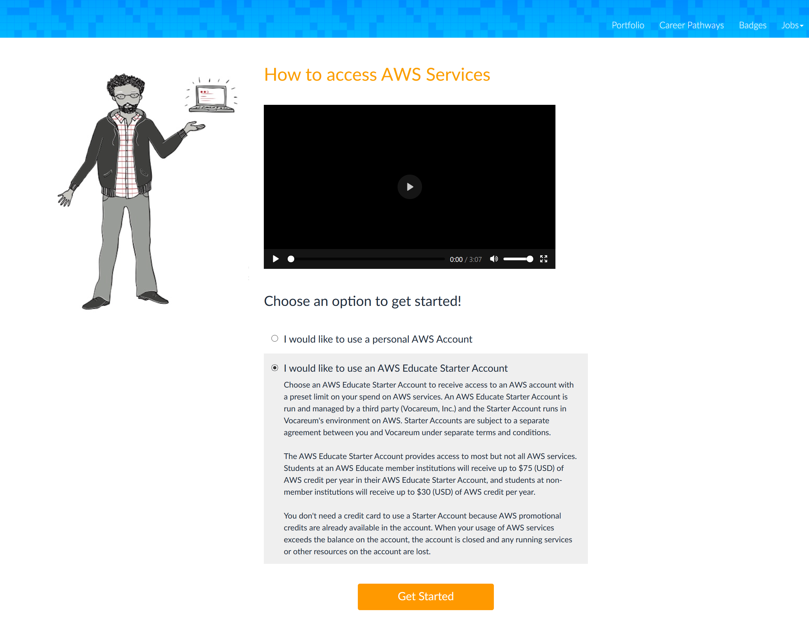
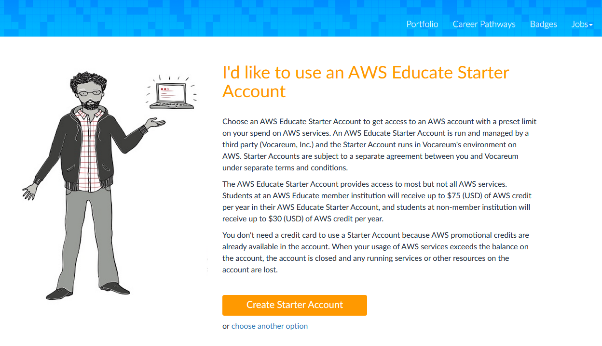
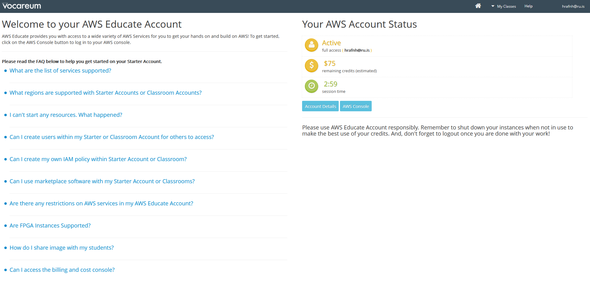

# AWS Student account

## Step 1 - Setting up a student account
Sign up for a student account on [AWS Educate] (https://aws.amazon.com/education/awseducate/)
Step 1: Select Join AWS Educate  
Step 2: Select Student 
Step 3. Fill out the following form 
Step 4. Read the Terms and Conditions 
Step 5. Confirm your email address   

... Wait for approval (can take 1-2 days)

Step 6. You should get an email with the subject "AWS Educate Application Approved", setup a password for your aws educate account

Step 7. Login to aws educate

Step 8. Go to AWS Account

Step 9. Select "I would like to use an AWS Educate Starter Account" then pres "Get Started"   

Step 10. Press "Create Starter Account"   

... Wait while the account is being provisioned

Step 11. Go to your aws educate starter account   

Step 12. Read the Terms and Conditions

Step 13. You should see   
