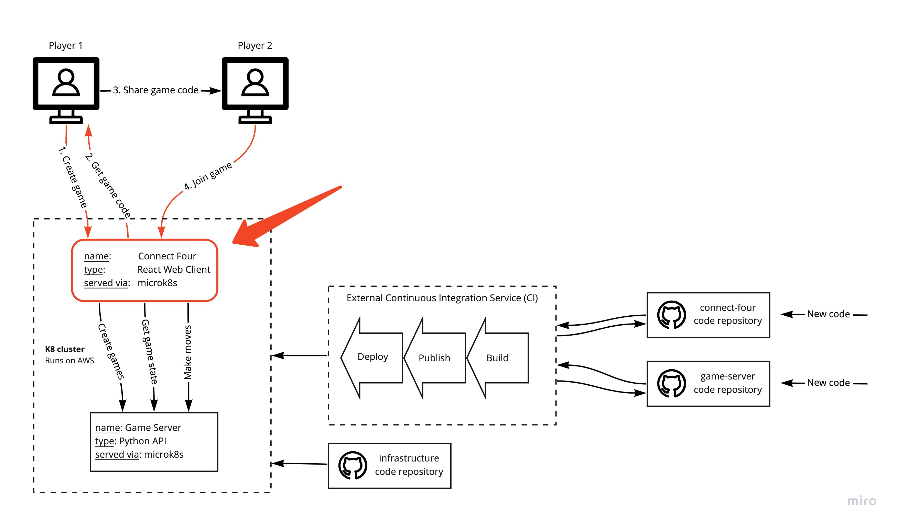
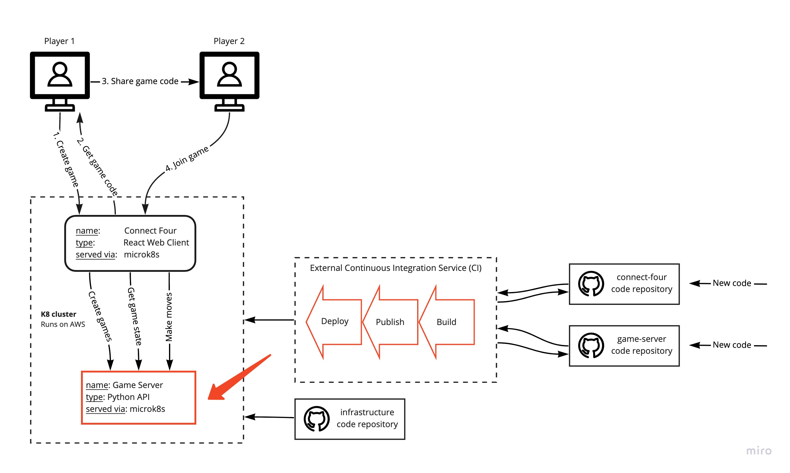

# Pipeline

Monday 30.11.2020

## Prerequisites
Before starting this part of the assignment we need to make sure we have the following up and running:
- [ ] An initial React web application
- [ ] A running Circle CI pipeline that:
    - On every push:
        - [ ] Builds a docker image from your code
        - [ ] Publishes a docker image from your code
    - On every merge to the main branch:
        - [ ] Builds a docker image from your code
        - [ ] Publishes a docker image from your code
        - [ ] Deploys your application to your kubernetes cluster

## Get up to date
If something wasn't working for you in week 1 you can use the current solution repositories to review and update your own projects.
NOTE: You'll still need to make sure that you replace the team name and the docker repository if you copy/paste code.
- [The infrastructure code can be found here](https://github.com/hgop/infrastructure-solution)
- [The client code can be found here](https://github.com/hgop/connect-four-client-solution)
Make sure you get help as soon as possible if something isn't working from week 1.

## Objectives
Today we want to add the actual game code. We've already made a simple connect-four game client for you to use. You'll also be setting up your own server, but only after your client is ready.
- [ ] Deploy a running Connect Four game client
- [ ] Setup your own Connect Four game server
- [ ] Create a Circle CI pipeline for your server
- [ ] Connect your server to your client

## Part 1 - Connect Four Client


The best practices when creating frontend clients is to try to make the as "dumb" as possible. I.e. if you can, try to have most/all of the logic on the server. Sometimes this is not possible and it's fine, but in those cases always try to extract your logic away from your UI components.
We split the client into two main parts.
1. UI components (only worry about how the website looks and is structured)
2. External Services (handles connecting to external services, in our case only the game server)

### Step 1 - Add the Connect Four Client code
Currently your repository should look like this:

```bash
.
├── .circleci
│   └── ...
├── public
│   └── ...
├── src
│   └── ...
├── .dockerignore
├── .gitignore
├── Dockerfile
├── k8s.yaml.template
├── tsconfig.json
├── README.md
├── package-lock.json
└── package.json
```

Use this repository: [Client Reference](https://github.com/hgop/connect-four-client-base), and copy the following folders and files and overwrite the ones you already have:
```bash
.
├── public
│   └── ...
├── src
│   └── ...
├── .gitignore
├── tsconfig.json
├── package-lock.json
└── package.json
```

After you copy/paste the code make sure you delete your old dependencies, i.e. your `node_modules` folder and install again: `npm install`.

### Step 2 - Deploy
Commit and push your code and make sure the game is working

## Part 2 - Update our kubernetes cluster
The server your're using for your client is not going to be available next week. You'll need to setup your own server. The server will include a database as well, which is called by your server from within the cluster, you will need to enable the DNS plugin in MicroK8s so that your pods can resolve hostnames for your services in kubernetes.

1. Ssh into your microk8 instance:
~~~bash
ssh -i "~/.aws/keys/MicroK8s.pem" ubuntu@{{team-name}}.hgopteam.com
~~~
2. Enable DNS: `microk8s.enable dns`

## Part 3 - Connect Four Server
Now it's time to use your own server. We've made a simple server for you to use as a base.

### Step 1 - Server Code


Create a new repository for your connect four server code.

Then copy the code from the following repository:

[Server Reference](https://github.com/hgop/connect-four-server-base)

After you've created your server repository and added the python code follow the README to start your server locally. After you get it running you can turn it off and move to the next step.

## Step 2 - Create Database
The Python connect four server uses a database. You are currently running all your applications on one kubernetes cluster and one environment. We'll take a better look at different environments later.
We need to make sure that we've deployed a database to your cluster before we deploy our server. We'll start by doing this only once and the database will stay up and running so we won't have to worry about it while we work on our server.
To create the database you can use the script `scripts/create_database.sh`. We'll need to specify a few environment variables for our database, replace the values as needed and you'll need to add these later when you create your pipeline:
```
export DATABASE_USERNAME=$(echo -n [YOUR_CHOSEN_USERNAME] | base64)
export DATABASE_PASSWORD=$(echo -n [YOUR_CHOSEN_PASSWORD] | base64)
export SECRET_KEY=$(echo -n [YOUR_CHOSEN_SECRET_KEY] | base64)
```

Then run the script:
```
bash scripts/create_database.sh default production
```

You can now check your cluster to see if your database deployment was a success:
```
kubectl get pods
```
Should a least include your connect4 client and your newly created database:
```
NAME                                 READY   STATUS    RESTARTS   AGE
connect4-544ffc6678-hqw2p            1/1     Running   0          41h
connect-four-database-production-0   1/1     Running   0          15m
```

Copy the name of your database pod to get the logs:
```
kubectl logs [YOUR_DATABASE_POD]
```
If the deployment was successful you should get logs that look something like this:
```
The files belonging to this database system will be owned by user "postgres".
This user must also own the server process.
The database cluster will be initialized with locale "en_US.utf8".
...
..
...
2020-11-28 16:06:16.482 UTC [1] LOG:  listening on IPv4 address "0.0.0.0", port 5432
2020-11-28 16:06:16.483 UTC [1] LOG:  listening on IPv6 address "::", port 5432
2020-11-28 16:06:16.486 UTC [1] LOG:  listening on Unix socket "/var/run/postgresql/.s.PGSQL.5432"
2020-11-28 16:06:16.502 UTC [66] LOG:  database system was shut down at 2020-11-28 16:06:16 UTC
2020-11-28 16:06:16.507 UTC [1] LOG:  database system is ready to accept connections
```

## Step 3 - Server Pipeline

Setup a circleci pipeline for the server repository, make sure that you use a separate docker repository (not account) for your server docker images.

You can use the Circle CI config from your client as a template (if your file was incorrect the first week make sure to update it or use the one from the [client solution](https://github.com/hgop/connect-four-client-solution)), but note you'll need to adjust it for your Python server.

~~~
Build => Publish => Deploy
~~~

TODO:
- [ ] Add Circle CI to your connect-four-server repository.
- [ ] Import environment variables from your connect-four-client Circle CI project.
- [ ] Change the image name IMAGE_NAME
- [ ] Change the username and the host in the `k8s.yaml.template` (image and host)
- [ ] Use deployment script to deploy the server (see information below)

To deploy the server we'll need to specify a few environment variable so instead of having a lot of config in the Circle CI config we've created a script to take care of it for us. You'll need to run the script `scripts/deploy.sh` in your deploy job in Circle CI instead of doing kubectl apply directly.
```
bash scripts/deploy.sh "default" "connect-four-server" "production" "${CIRCLE_SHA1}"
```

## Step 4 - Connect server
NOTE: The server does not work the same as the server you're currently using, i.e. there is some logic missing, but you'll fix that on Day 7.

Now switch out the server API_URL in the client for your API_URL and make sure everything is up and running.

## Handin

You should store all the source files in your repository:

connect-four-client repository:
```bash
.
├── .circleci
│   └── config.yml
├── public
│   ├── ...
│   └── index.html
├── src
│   ├── components
│   │   ├── App
│   │   │   ├── App.tsx
│   │   │   └── ...
│   │   ├── Board
│   │   │   ├── Board.tsx
│   │   │   └── ...
│   │   ├── ...
│   │   └── index.tsx
│   ├── external_services
│   │   └── game_api_client.ts
│   ├── serviceWorker.ts
│   ├── index.css
│   └── index.tsx
├── .dockerignore
├── .gitignore
├── Dockerfile
├── k8s.yaml.template
├── tsconfig.json
├── README.md
├── package-lock.json
└── package.json
```

connect-four-server repository:
```bash
.
├── .circleci
│   └── config.yml
├── connect4
│   ├── __init__.py
│   ├── app.py
│   ├── app_logic.py
│   ├── config.py
│   ├── converter.py
│   ├── database.py
│   ├── exceptions.py
│   ├── game_logic.py
│   ├── models.py
│   └── tokens.py
├── scripts
│   ├── create_database.sh
│   └── deploy.py
├── .gitignore
├── database.yaml.template
├── Dockerfile
├── docker-compose.yaml
├── k8s.yaml.template
├── README.md
├── requirements.txt
└── requirements_dev.txt
```
