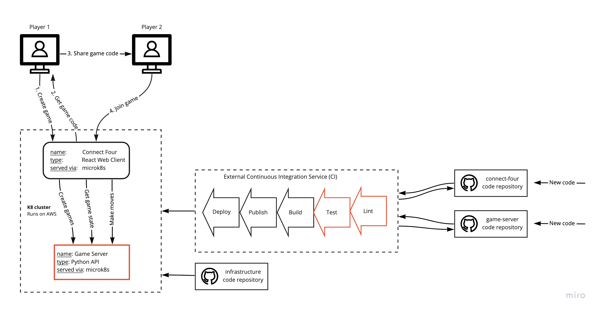

# Unit testing and code analysis

Tuesday 01.12.2020

## Prerequisites
Before starting this part of the assignment we need to make sure we have the following up and running:
- [ ] A running Circle CI pipeline for client and server
- [ ] A live working game

## Objectives
Today we want to add steps to make sure we don't deploy our applications without testing them first.
- [ ] Add linting and testing step to your client pipeline
- [ ] Add unit tests to your client
- [ ] Add linting and testing step to your server pipeline
- [ ] Add unit tests to your server

## Part 1 - Connect Four Client


### Step 1 - Add test job to Connect Four client
First we want to make sure our Circle CI runs our tests.
Add a test job to your Circle CI config.
```
  test:
    docker:
      - image: circleci/node:12.9.1-browsers
    steps:
      - checkout
      - restore_cache:
          keys:
            - dependencies-{{ checksum "package.json" }}
            - dependencies-
      - run: npm install
      - save_cache:
          key: dependencies-{{ checksum "package.json" }}
          paths:
            - node_modules
            - ~/.npm 
            - ~/.cache
      - run: npm test
```
This job does the following:
1. It loads a node envrionment:
```
    docker:
      - image: circleci/node:12.9.1-browsers
```
2. It runs the following steps:
    1. checkouts our code: `- checkout`
    2. checks if our dependenices (package.json) have changed and if not loads them from the cache (we do this for a faster build)
    3. installs our dependencies (if they were fetched from cache this will be almost instant)
    4. saves the dependencies in cache
    5. runs our tests

Now make sure to add the test job to the workflow.
Whe your pipeline has passed you can move to the next step.

### Step 2 - Test our application
Since our client application was bootstrapped with `react-script` we want to follow their lead when it comes to testing.
Create React App uses Jest as its test runner, documentation for testing our type of application can be found [here](https://create-react-app.dev/docs/running-tests/).
We also want to add component testing, i.e. render our components and assert that they render correctly. For this we need to add two testing libraries, follow the instructions in the documentation, [found here](https://create-react-app.dev/docs/running-tests/#testing-components).

After you've installed the libraries you should create a test file for your `App.tsx` component, like so:
`src/components/App/App.test.js`
~~~
import React from "react";
import { render, screen } from "@testing-library/react";
import "@testing-library/jest-dom";
import App from "./App";

it("should render welcome message", () => {
  render(<App />);

  expect(screen.getByText("Connect Three!")).toBeInTheDocument();
});
~~~

Now run the tests: `npm test`
Update the test so it passes.

Now add these tests for the Board:
`src/components/Board/Board.test.js`
~~~
import React from 'react';
import { render, screen } from '@testing-library/react';
import '@testing-library/jest-dom';
import Board from './Board';

it('should render correct number of columns', () => {
  render(<Board columns={3} rows={4} board={[[], [], []]} onTileClick={(_) => { }} />)

  expect(screen.getAllByLabelText('column')).toHaveLength(?)
});

it('should render correct number of tiles', () => {
  render(<Board columns={2} rows={3} board={[[], []]} onTileClick={(_) => { }} />)

  expect(screen.getAllByLabelText('tile')).toHaveLength(?)
});
~~~
Guess the values, then run the tests, and adjust until they pass.

Now use these [API docs](https://testing-library.com/docs/react-testing-library/api) for the component testing library and finish testing all the client's components.
NOTE: you should add tests to `App` and `Board` as needed. List of components:
- [ ] App
- [ ] Board
- [ ] Column
- [ ] LocalCoopGame
- [ ] OnlineMultiplayerGame
- [ ] StartGame
- [ ] Tile

You'll need to make sure you're testing all major states that each component can inhibit.

### Step 3 - Add a linter to our application
> A linter is great for identifying errors when you use standard rules. Remember, a linter analyzes your code for stylistic and programming errors against the rules it knows. If part of your code breaks the standard rules, this can pose a problem.

1. Add lint script
Eslint comes included when we uses the Create React App script to create our application. To run eslint we can run the binary directly from our `node_modules` like so: `./node_modules/.bin/eslint`, but it's nicer to create a npm script to do this. We want to add a npm command to run lint on the following files: `ts, tsx` in the directory `src`.
You do that by adding a script in your `package.json`, like so:
```

  "scripts": {
    "start": "react-scripts start",
    "build": "react-scripts build",
    "lint": "eslint --ext ts,tsx src", <- Add this line
    "test": "react-scripts test",
    "eject": "react-scripts eject"
  },
```

2. Add lint Job
Now add a `lint` job in your Circle CI config that runs this script.

3. Actually have some lint rules
The default lint rules don't really help you keep your code consistent. We need more rules.
Let's fix it by initializing eslint in our application. You can do that by running:

`./node_modules/.bin/eslint --init`
And answering the following questions:
```
✔ How would you like to use ESLint?
   ❯ To check syntax and find problems
✔ What type of modules does your project use?
    ❯ JavaScript modules (import/export)
✔ Which framework does your project use?
    ❯ React
✔ Does your project use TypeScript?
    ❯ Yes
✔ Where does your code run?
    ❯ Browser
✔ What format do you want your config file to be in?
    ❯ JavaScript
The config that you've selected requires the following dependencies:

eslint-plugin-react@latest @typescript-eslint/eslint-plugin@latest @typescript-eslint/parser@latest
✔ Would you like to install them now with npm?
    ❯ Yes 
```

Now run `npm run lint` and observe the warnings and errors you get. Fix the errors, commit and push your code.
NOTE: You can also remove rules that you don't agree with, e.g. if we don't like the rule that disallows empty interfaces we can set it as "off" in the `.eslintrc.js` config, like so:
```
  "rules": {
    "@typescript-eslint/no-empty-interface": "off"
  }
```

## Part 2 - Connect Four Server


### Part 1 - Add a linter to our server

You will need to setup a python executor for version 3.8.4
~~~yaml
  python:
    docker:
      - image: circleci/python:3.8.4
~~~

And add a lint job:
~~~yaml
  lint:
    executor: python
    steps:
      - checkout
      - run: pip install -r requirements.txt -r requirements_dev.txt
      - run: mypy connect4/
~~~
Remember to add lint to the config workflow.

### Part 2 - Setup unit tests

Create requirements file for you tests:

`requirements_tests.txt`
~~~
pytest==6.1.2
~~~
NOTE: you'll need to reinstall your dev dependencies

Create the following directory structure:
~~~
.
└── tests
    ├── __init__.py
    └── unit
        └── __init__.py
~~~

`tests/unit/helper.py`
~~~python
from connect4 import models
from typing import List

def get_empty_board() -> List[List[models.Tile]]:
    return [
        [models.Tile.EMPTY, models.Tile.EMPTY, models.Tile.EMPTY, models.Tile.EMPTY, models.Tile.EMPTY, models.Tile.EMPTY],
        [models.Tile.EMPTY, models.Tile.EMPTY, models.Tile.EMPTY, models.Tile.EMPTY, models.Tile.EMPTY, models.Tile.EMPTY],
        [models.Tile.EMPTY, models.Tile.EMPTY, models.Tile.EMPTY, models.Tile.EMPTY, models.Tile.EMPTY, models.Tile.EMPTY],
        [models.Tile.EMPTY, models.Tile.EMPTY, models.Tile.EMPTY, models.Tile.EMPTY, models.Tile.EMPTY, models.Tile.EMPTY],
        [models.Tile.EMPTY, models.Tile.EMPTY, models.Tile.EMPTY, models.Tile.EMPTY, models.Tile.EMPTY, models.Tile.EMPTY],
        [models.Tile.EMPTY, models.Tile.EMPTY, models.Tile.EMPTY, models.Tile.EMPTY, models.Tile.EMPTY, models.Tile.EMPTY],
        [models.Tile.EMPTY, models.Tile.EMPTY, models.Tile.EMPTY, models.Tile.EMPTY, models.Tile.EMPTY, models.Tile.EMPTY]
    ]

def get_initial_game_state() -> models.Game:
    return models.Game(
        gameId = "",
        active = True,
        winner = None,
        activePlayer = models.Player.ONE,
        board = get_empty_board()
    )
~~~

`tests/unit/test_converter.py`
~~~python
from connect4 import converter
from connect4 import models
from tests.unit import helper
from typing import List

# converter.optional_int_to_player
def test_optional_int_to_player_none():
    assert None == converter.optional_int_to_player(None)

def test_optional_int_to_player_1():
    assert models.Player.ONE == converter.optional_int_to_player(1)

def test_optional_int_to_player_2():
    assert models.Player.TWO == converter.optional_int_to_player(2)

# converter.optional_player_to_int
def test_optional_player_to_int_none():
    assert None == converter.optional_player_to_int(None)

def test_optional_player_to_int_one():
    assert 1 == converter.optional_player_to_int(models.Player.ONE)

def test_optional_player_to_int_two():
    assert 2 == converter.optional_player_to_int(models.Player.TWO)

# converter.int_to_player
def test_int_to_player_1():
    assert models.Player.ONE == converter.int_to_player(1)

def test_int_to_player_2():
    assert models.Player.TWO == converter.int_to_player(2)

# converter.player_to_int
def test_player_to_int_one():
    assert 1 == converter.player_to_int(models.Player.ONE)

def test_player_to_int_two():
    assert 2 == converter.player_to_int(models.Player.TWO)

# TODO converter.int_to_tile
# TODO converter.player_to_tile
# TODO converter.tile_to_int

# converter.str_to_board
def test_str_to_board_empty():
    board_str = (
        "000000"
      + "000000"
      + "000000"
      + "000000"
      + "000000"
      + "000000"
      + "000000"
    )
    board = helper.get_empty_board()
    assert board == converter.str_to_board(board_str)

def test_str_to_board_one_chip():
    board_str = (
        "000000"
      + "100000"
      + "000000"
      + "000000"
      + "000000"
      + "000000"
      + "000000"
    )
    board = helper.get_empty_board()
    board[1][0] = models.Tile.ONE
    assert board == converter.str_to_board(board_str)
~~~

`tests/unit/test_game_logic.py`
~~~python
from connect4 import game_logic
from connect4 import models
from tests.unit import helper
from typing import List

# game_logic.make_move
def test_make_move_returns_new_object():
    game_input = helper.get_initial_game_state()

    game_output = game_logic.make_move(game_input, 0)

    assert game_input != game_output

def test_make_move_set_tile_one():
    game_input = helper.get_initial_game_state()

    game_output = game_logic.make_move(game_input, 0)

    assert models.Tile.ONE == game_output.board[0][0]

def test_make_move_set_tile_two():
    game_input = helper.get_initial_game_state()
    game_input.activePlayer = models.Player.TWO

    game_output = game_logic.make_move(game_input, 0)

    assert models.Tile.TWO == game_output.board[0][0]

def test_make_move_horizontal_win_one():
    game_input = helper.get_initial_game_state()
    game_input.board[0][0] = models.Tile.ONE
    game_input.board[1][0] = models.Tile.ONE
    game_input.board[2][0] = models.Tile.ONE
    
    game_output = game_logic.make_move(game_input, 3)

    assert False == game_output.active
    assert models.Player.ONE == game_output.winner

def test_make_move_horizontal_win_two():
    game_input = helper.get_initial_game_state()
    game_input.activePlayer = models.Player.TWO
    game_input.board[0][0] = models.Tile.TWO
    game_input.board[1][0] = models.Tile.TWO
    game_input.board[2][0] = models.Tile.TWO
    
    game_output = game_logic.make_move(game_input, 3)

    assert False == game_output.active
    assert models.Player.TWO == game_output.winner

def test_make_move_vertical_win_one():
    game_input = helper.get_initial_game_state()
    game_input.board[0][0] = models.Tile.ONE
    game_input.board[0][1] = models.Tile.ONE
    game_input.board[0][2] = models.Tile.ONE
    
    game_output = game_logic.make_move(game_input, 0)

    assert False == game_output.active
    assert models.Player.ONE == game_output.winner

def test_make_move_vertical_win_two():
    game_input = helper.get_initial_game_state()
    game_input.activePlayer = models.Player.TWO
    game_input.board[0][0] = models.Tile.TWO
    game_input.board[0][1] = models.Tile.TWO
    game_input.board[0][2] = models.Tile.TWO
    
    game_output = game_logic.make_move(game_input, 0)

    assert False == game_output.active
    assert models.Player.TWO == game_output.winner

# TODO test diagonal wins

# game_logic.is_column_full
def test_is_column_full_empty():
    game_input = helper.get_initial_game_state()

    is_column_full = game_logic.is_column_full(game_input, 0)

    assert False == is_column_full

def test_is_column_full_full():
    game_input = helper.get_initial_game_state()
    for y in range(6):
        game_input.board[0][y] = models.Tile.ONE

    is_column_full = game_logic.is_column_full(game_input, 0)

    assert True == is_column_full
~~~

`tests/unit/test_app_logic.py`
~~~python
from connect4 import app_logic, models
from unittest.mock import patch
from tests.unit import helper
from unittest.mock import Mock

def test_index():
    message, code = app_logic.index()
    assert message == "Game Server"
    assert code == 200

def test_status():
    message, code = app_logic.status()
    assert message == "Running"
    assert code == 200

@patch("connect4.database.create_game")
@patch("connect4.database.add_player_to_game")
@patch("connect4.tokens.generate_token")
def test_create_game(mock_generate_token, mock_add_player_to_game, mock_create_game):
    mock_generate_token.side_effect = ["token1", "token2"]
    mock_create_game.return_value = None
    mock_add_player_to_game.return_value = None
    message, code = app_logic.create_game({})
    assert {
        "gameId": "token1", 
        "active": True, 
        "playerId": "token2", 
        "winner": None, 
        "playerNumber": models.Player.ONE, 
        "activePlayer": models.Player.ONE, 
        "playerCount": 1, 
        "board": helper.get_empty_board()
    } == message
    assert code == 201

# TODO
~~~

You should be able to run the tests by doing:

~~~bash
pytest tests/unit
~~~

Your server is missing some game logic, so your test will fail. Still you should move on to the next step and add the game logic after you've added the test job to your CI pipeline.

### Part 3 - Setup unit tests job in CircleCI

~~~yaml
  unit_test:
    executor: python
    steps:
      - checkout
      - run: pip install -r requirements.txt -r requirements_test.txt
      - run: pytest tests/unit
~~~

### Part 4 - Coverage

Add `pytest-cov` package to your test requirements.

Now you can see the code coverage of your tests using:

~~~bash
pytest --cov=connect4 tests/unit
~~~

### Part 5 - More tests and Implementation

- Test all game logic (No need to unit test `app.py` or `database.py`).
- Implement and test all missing game logic which is marked with TODOs in connect4/game_logic.py.

## Handin

You should store all the source files in your repository:

connect-four-client repository:
```bash
.
├── .circleci
│   └── config.yml
├── public
│   ├── ...
│   └── index.html
├── src
│   ├── components
│   │   ├── App
│   │   │   ├── App.tsx
│   │   │   ├── App.test.js
│   │   │   └── ...
│   │   ├── Board
│   │   │   ├── Board.tsx
│   │   │   ├── Board.test.js
│   │   │   └── ...
│   │   ├── Column
│   │   │   ├── Column.tsx
│   │   │   ├── Column.test.js
│   │   │   └── ...
│   │   ├── LocalCoopGame
│   │   │   ├── LocalCoopGame.tsx
│   │   │   ├── LocalCoopGame.test.js
│   │   │   └── ...
│   │   ├── OnlineMultiplayerGame
│   │   │   ├── OnlineMultiplayerGame.tsx
│   │   │   ├── OnlineMultiplayerGame.test.js
│   │   │   └── ...
│   │   ├── StartGame
│   │   │   ├── StartGame.tsx
│   │   │   ├── StartGame.test.js
│   │   │   └── ...
│   │   ├── Tile
│   │   │   ├── Tile.tsx
│   │   │   ├── Tile.test.js
│   │   │   └── ...
│   │   └── index.tsx
│   ├── external_services
│   │   └── game_api_client.ts
│   ├── serviceWorker.ts
│   ├── react-app-env.d.ts
│   ├── index.css
│   └── index.tsx
├── .dockerignore
├── .gitignore
├── Dockerfile
├── k8s.yaml.template
├── tsconfig.json
├── README.md
├── package-lock.json
└── package.json
```

connect-four-server repository:
```bash
.
├── .circleci
│   └── config.yml
├── connect4
│   ├── __init__.py
│   ├── app.py
│   ├── app_logic.py
│   ├── config.py
│   ├── converter.py
│   ├── database.py
│   ├── exceptions.py
│   ├── game_logic.py
│   ├── models.py
│   └── tokens.py
├── connect4
│   ├── create_database.sh
│   └── deploy.py
├── tests
│   ├── __init__.py
│   └── unit
│       ├── __init__.py
│       └── test_*.py
├── .gitignore
├── database.yaml.template
├── Dockerfile
├── docker-compose.yaml
├── k8s.yaml.template
├── README.md
├── requirements.txt
└── requirements_dev.txt
```
